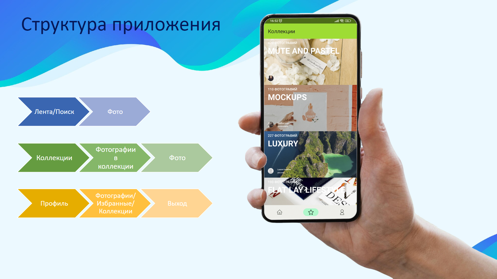
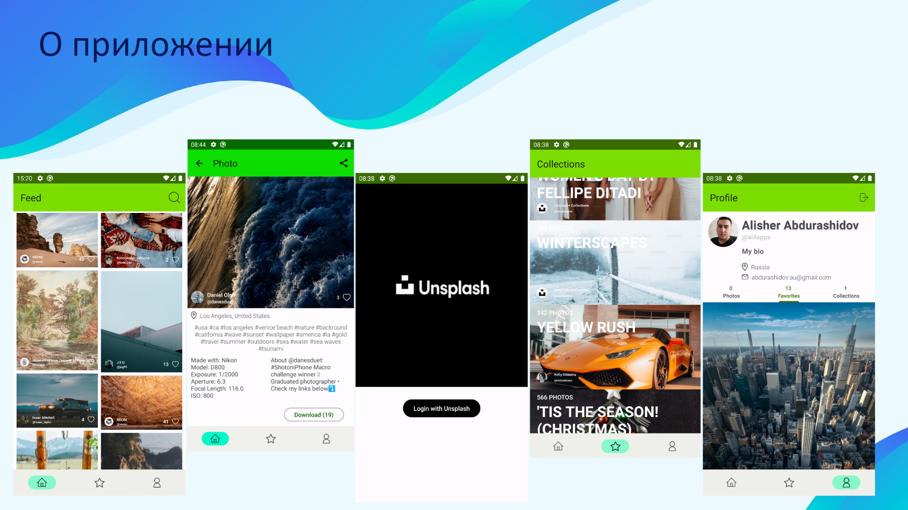

# Unspray  

**Unspray** — это Android-клиент для [Unsplash](https://unsplash.com), позволяющий искать, просматривать и управлять фотографиями из API Unsplash.  

## 🚀 Возможности  
- 🔑 **Авторизация** через Unsplash (OAuth 2.0)  
- 🖼 **Лента** с изображениями (+ просмотр детальной информации, скачивание, добавление в избранное)  
- 🔍 **Поиск** фотографий по тегам и ключевым словам  
- 📁 **Коллекции** (просмотр, добавление, управление)  
- 👤 **Профиль пользователя** (загруженные фото, избранное, коллекции)  

## 🛠 Технологии  
- Kotlin + Android Views (XML)  
- Retrofit + OkHttp (работа с API)  
- Room (локальное хранилище)  
- Glide (загрузка изображений)  
- Coroutines + Flow
- Hilt
- Paging Library + Paging Remote Mediator
- OAuth 2.0  

## 📸 Изображения  

